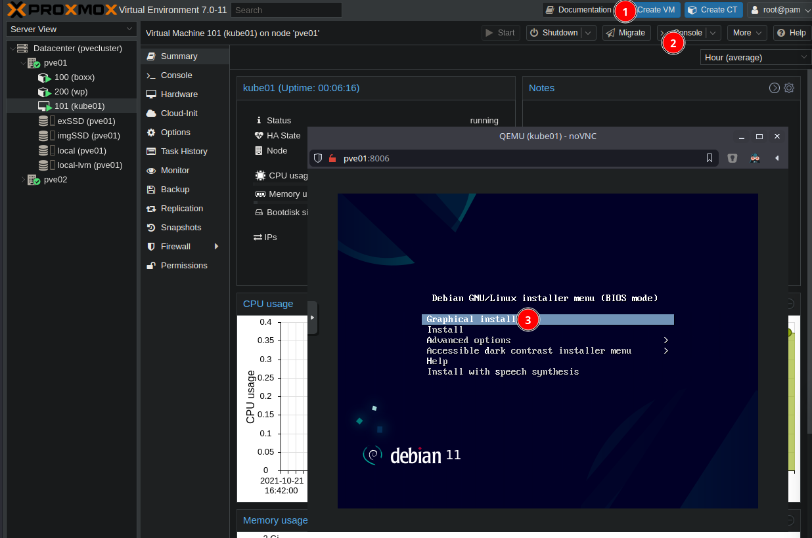

# Kubernets install on Proxmox for learning and testing

First download latest Debian Stable iSO image:
https://cdimage.debian.org/debian-cd/current/amd64/iso-cd/

in my case "Download from url" from https://cdimage.debian.org/debian-cd/current/amd64/iso-cd/debian-11.1.0-amd64-netinst.iso

`sha256sum debian-11.1.0-amd64-netinst.iso `

## Create VM

Name: **kube01**

Disk Size: **32 GiB**

CPU: **2**

Memory: **2048 MiB**

Other: **default**

## Install Debian OS

Using  >_Console **noVNC**

Graphical install

* Language **English**
* Location **Sweden**
* Locales **United States en_US.UTF-8**
* Keyboard **Swedish**
  (I just type "sw" and autocomplite to Swedish )
* Hostname **kube01** and domain **ns**.
* Root and user.
* Guided partitioning, entire disk, all file in one partition, OBS. **remove SWAP** and extend **/**.
* All files in one partition.
* Software selection **SSH Server** and **Standard System Utilities**.
* Rest default /rest default
* IP is set with pFsense DHCP server - Static Mapping to **192.168.10.101**

## SSH to VM

